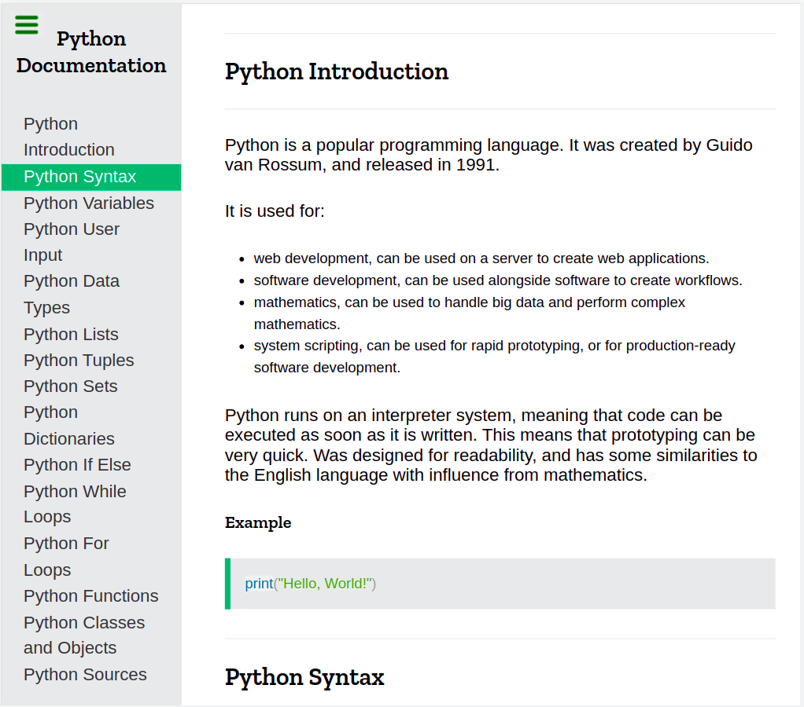

# Technical-doc-page - FreeCodeCamp project

### During my learning, I tried to get inspiration from other websites and  create replicas of their elements.

#### As part of FreeCodeCamp's Responsive Web Design course, I built a technical documentation page,  with elements replicated from ***W3Schools*** and ***MDN Web Docs***.

***

#### This page uses `HTML` and `CSS` and helped get more practice with:

* working with text elements and focusing on the Typography for the page 
* using tables
* organize the properties inside each CSS selector based on type and alphabetically to improve code readability

#### While building this page, I gained more knowledge in: 

* Python code syntax highlighting using Prism

***
***

#### Check out the result:

